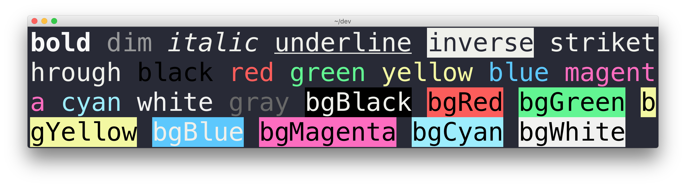
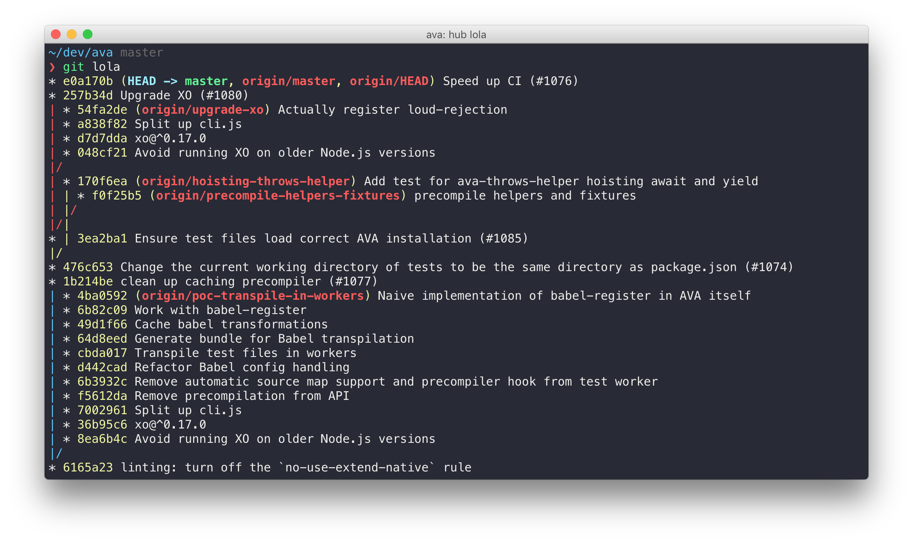

# iterm2-snazzy

> Elegant [iTerm2](https://www.iterm2.com) theme with bright colors

## Install

- Right-click [`Snazzy.itermcolors`](https://github.com/sindresorhus/iterm2-snazzy/raw/master/Snazzy.itermcolors) and choose `Save Link As…`.
- Double-click the downloaded file.

## Tip

To get the exact same look as in the screenshot, you need to use the [Pure](https://github.com/sindresorhus/pure) prompt, Menlo font, and the [zsh-syntax-highlighting](https://github.com/zsh-users/zsh-syntax-highlighting) plugin to have commands highlighted.

## Related

- [hyper-snazzy](https://github.com/sindresorhus/hyper-snazzy) - Hyper version
- [terminal-snazzy](https://github.com/sindresorhus/terminal-snazzy) - Terminal version

## License

MIT © [Sindre Sorhus](https://sindresorhus.com)
